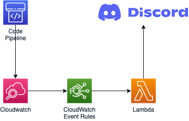

# discord-notifier

[Go](https://golang.org/) based lambda notfier to send messages to discord.

## Architecture

## Prerequisite

- [go 1.x](https://golang.org/)
- [serverless](https://www.serverless.com/)

## Build

`make`

## Deploy

`DISCORD_WEBHOOK_URL` must be set to a valid discord webhook

`make deploy`

## Test

`sls invoke -f discord-notifier`

This you send a message to your channel

## Todo

- Add Cloudwatch Event rule
- Code clean up
- Tests
- Do somethine about lambda versions [versionFunctions](https://www.serverless.com/framework/docs/providers/aws/guide/functions/) or [Plugin Prune](https://github.com/claygregory/serverless-prune-plugin) [Strategies](https://www.mode2.com/news/strategies-to-manage-aws-lambda-versions/)
- Do a CDK Version

## Some helpful URLS

- <https://github.com/aws/aws-lambda-go/issues/51>
- <https://pkg.go.dev/github.com/aws/aws-lambda-go/events#CloudWatchEvent>
- <https://gemisis.medium.com/building-a-serverless-discord-bot-on-aws-5dc7d972c9c6>
- <https://birdie0.github.io/discord-webhooks-guide/discord_webhook.html>
- <https://gist.github.com/Birdie0/78ee79402a4301b1faf412ab5f1cdcf9>
- <https://stackoverflow.com/questions/53935198/in-my-discord-webhook-i-am-getting-the-error-embeds-0>
- <https://docs.aws.amazon.com/AmazonCloudWatch/latest/events/EventTypes.html>
